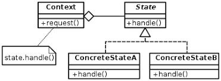

# **STATE PATTERN**
The `state` pattern is a behavioral software design pattern that allows an object to alter its behavior when its internal state changes.

The `state` pattern is used in computer programming to encapsulate varying behavior for the same object, based on its internal state.

**Polymorphism** is a mechanism that can be used to implement the OO modelling known as a State pattern.

### Advantages

**(1)** Open closed Principle is implemented, where our program is open for extension and not for modification.

**(2)** The State pattern minimizes conditional complexity, eliminating the need for if and switch statements in objects that have different behavior requirements unique to different state transitions.

### Disadvantages

The State pattern requires a lot of code to be written. Depending on how many different state transition methods are defined, and how many possible states an object can be in