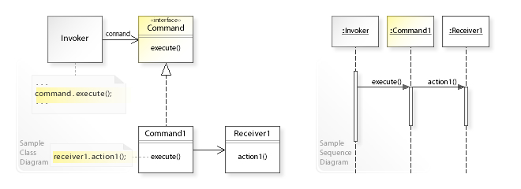
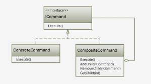
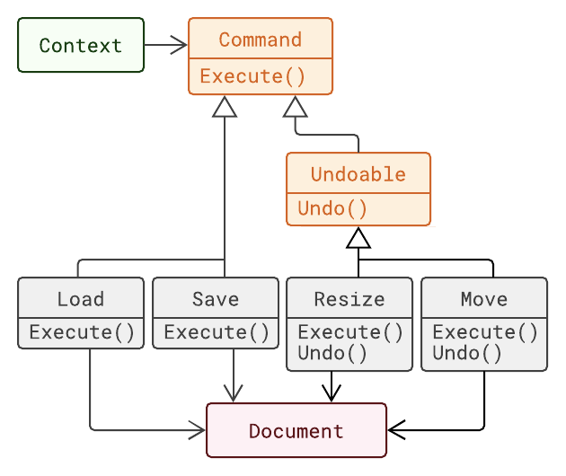

# **The Command Pattern**
In object-oriented programming, the command pattern is a behavioral design pattern in which an object is used to encapsulate all information needed to perform an action or trigger an event at a later time. This information includes the method name, the object that owns the method and values for the method parameters.

# **The Composite Command Pattern**
Composite command is mix of command and composite patterns and it forms command that consists of child commands that are executed once together. 

# **Undoable Mechanism of Command Pattern**
Command pattern for undo functionality Command is a very powerful design pattern, whose intent is to encapsulate a request as an object, thereby letting you parameterize clients with different requests, queue or log requests, and support undoable operations.

# Pros
1) It decouples the classes that invoke the operation from the object that knows how to execute the operation
2) It allows you to create a sequence of commands by providing a queue system
3) Extensions to add a new command is easy and can be done without changing the existing code
4) You can also define a rollback system with the Command pattern, for example, in the Wizard example, we could write a rollback method

# Cons
1) There are a high number of classes and objects working together to achieve a goal. Application developers need to be careful developing these classes correctly.
2) Every Individual command is a concrete command that increases the volume of classes for implementation and maintenance.