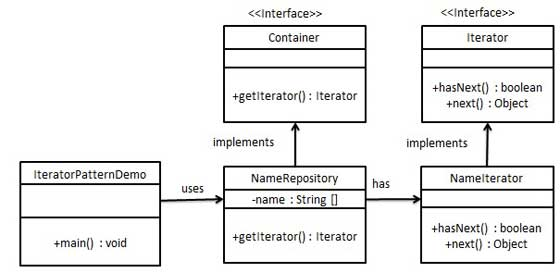

# **The Iterator Pattern**
The `iterator` pattern is a design pattern in which an iterator is used to traverse a container and access the container's elements.

The `Iterator` design pattern is one of the twenty-three well-known GoF design patterns that describe how to solve recurring design problems to design flexible and reusable object-oriented software, that is, objects that are easier to implement, change, test, and reuse.

### For this source code
1) The BrowserHistory represents the NameRepository in the diagram
2) The ListIterator represents the NameIterator in the diagram

### Advantages of Iterator Design Pattern
1) The code is easier to use, understand and test since the iterator uses the Single Responsibility and Open/Closed SOLID principles.
2) Allows us to change the internal implementation of a collection with no change in the algorithm's implementation.
3) Allows us to add new algorithms which work all existing collection types.
4) Parallel iteration over the same collection because each iterator object contains its own iteration state.

### Disadvantages of Iterator Design Pattern
1) The main disadvantage is that the iterator will have to access internal members of the aggregate. In Java and . NET this can be done, without violating the encapsulation principle, by making the iterator an inner class of the aggregate class.
2) It tempts you to start coding before you have a clear idea of what you want to do. Think about the problem a little bit before you start.

### Iterator Pattern: When To Use
1) Your collection has a complex data structure under the hood, but you want to hide its complexity from clients.
2) You need to reduce duplication of traversal code across your app.
3) You want your code to be able to traverse different data structures.
