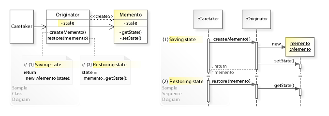

# **The Momento Pattern** 
The `memento` pattern is a software design pattern that provides the ability to restore an object to its previous state (undo via rollback). 

It is used to implement the UNDO mechanism.

### The memento pattern is implemented with three objects:
1) The originator => for this project, it is called Editor
2) The momento => for this project, it is called Editor State
3) The caretaker => for this project, it is called History

The **`originator`** is some object that has an internal state. The **`caretaker`** is going to do something to the originator, but wants to be able to undo the change. The caretaker first asks the originator for a **`memento`** object. Then it does whatever operation (or sequence of operations) it was going to do.

### Advantages of Memento Design Pattern
1) It stores the objects state without compromising encapsulation.
Provides a recovery mechanism in case of failures.
2) It provides a way to maintain history of an object's life cycle.

### Disadvantages of Memento Design Pattern
1) The application will consume a huge amount of RAM if the user creates mementos many times.
2) The extra time to save the states will reduce the overall performance of the application.