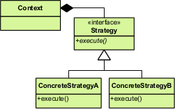
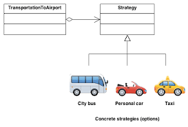

#**The strategy pattern**
The `strategy` pattern (also known as the policy pattern) is a behavioral software design pattern that enables selecting an algorithm at runtime. Instead of implementing a single algorithm directly, code receives run-time instructions as to which in a family of algorithms to use.

###Advantages of the Strategy Pattern
1) It's easy to switch between different algorithms (strategies) in runtime because you're using polymorphism in the interfaces.
2) Clean code because you avoid conditional-infested code (not complex).
3) More clean code because you separate the concerns into classes (a class to each strategy).
4) simplified unit testing, because each algorithm has its own class, can be tested by their own interface.
5) Adheres to most grasp principles and common design principles, high cohesion, low coupling.

###Disadvantages of the Strategy Pattern
1) The application must be aware of all the strategies to select the right one for the right situation. 
2) Each specific policy class will produce a new class, it will increase the number of classes the system needs to maintain.

###Difference between Strategy Pattern and State Pattern
1) `State pattern` helps object to manage state, while `Strategy pattern` allows the client to choose different behavior.
2) `State pattern` encapsulate state of an Object while `Strategy Pattern` encapsulates an algorithm or strategy.