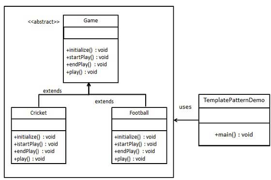
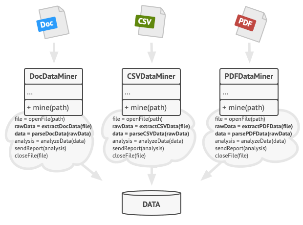

# **The Template pattern**

In Template pattern, an abstract class exposes defined way(s)/template(s) to execute its methods. Its subclasses can override the method implementation as per need, but the invocation is to be in the same way as defined by an abstract class. This pattern comes under behavior pattern category.

Template Method is a behavioral design pattern that defines the skeleton of an algorithm in the superclass but lets subclasses override specific steps of the algorithm without changing its structure.

# Problem

Imagine that you’re creating a data mining application that analyzes corporate documents. Users feed the app documents in various formats (PDF, DOC, CSV), and it tries to extract meaningful data from these docs in a uniform format.

The first version of the app could work only with DOC files. In the following version, it was able to support CSV files. A month later, you “taught” it to extract data from PDF files.

At some point, you noticed that all three classes have a lot of similar code. While the code for dealing with various data formats was entirely different in all classes, the code for data processing and analysis is almost identical. Wouldn’t it be great to get rid of the code duplication, leaving the algorithm structure intact?

read more https://refactoring.guru/design-patterns/template-method

## Relations with Other Patterns
1) Factory Method is a specialization of Template Method. At the same time, a Factory Method may serve as a step in a large Template Method.
2) Template Method works at the class level, so it’s static. Strategy works on the object level, letting you switch behaviors at runtime.

## Pros
1) You can let clients override only certain parts of a large algorithm, making them less affected by changes that happen to other parts of the algorithm.
2) You can pull the duplicate code into a superclass.

## Cons
1) Some clients may be limited by the provided skeleton of an algorithm.
2) You might violate the Liskov Substitution Principle by suppressing a default step implementation via a subclass
3) Template methods tend to be harder to maintain the more steps they have.